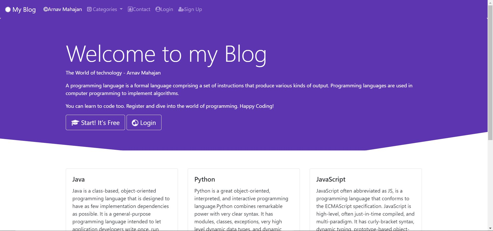
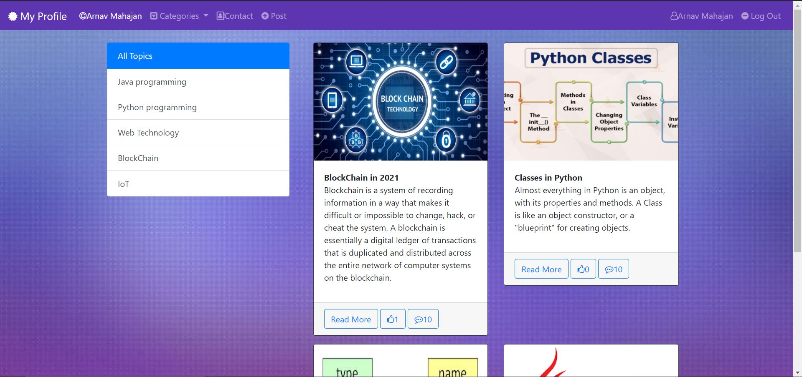
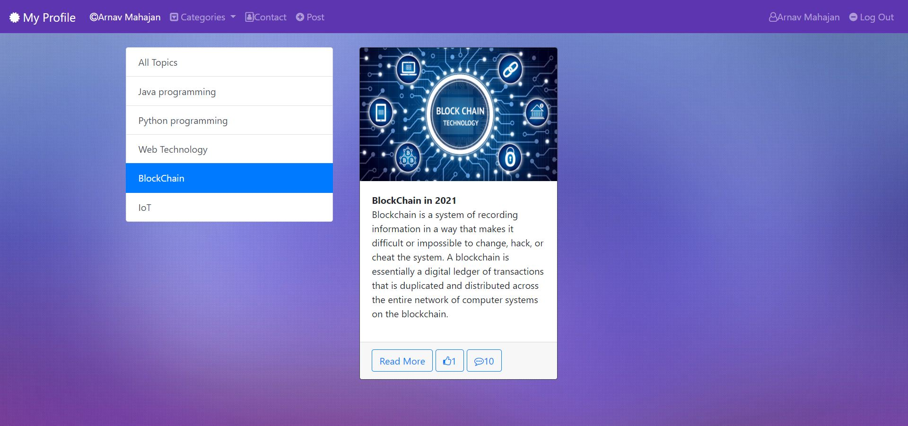
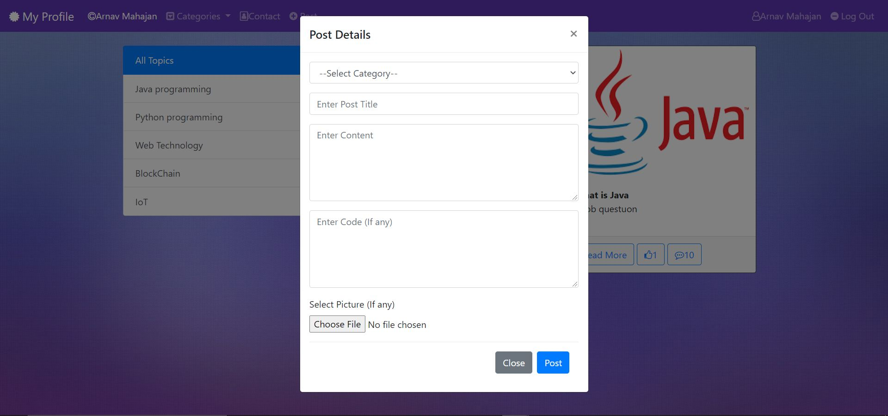
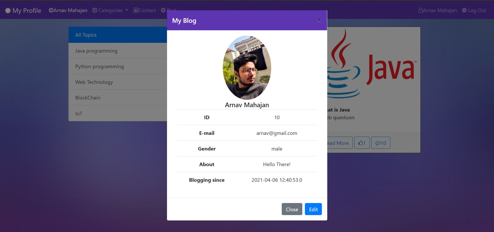
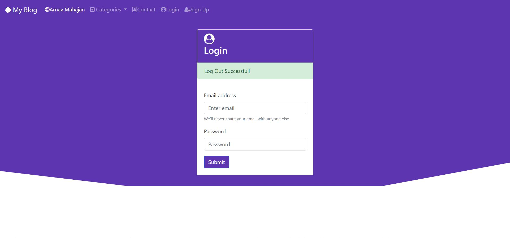

# My Blog

A simple blog website where users can post their own blogs and view other user's blogs.

# Home Page
The Welcome page of the web application

# Login Home Page
Welcome screen after a successful user login showing all the recent posts with their thumbnails, likes and comments.

Users can sort or filter the posts on the type of topic they want.

# Post Modal
A default modal for posting a post to the web application which all other users can see.

# Profile Modal
User can view aand edit his own profile details through this modal which will be updated in real time for other users to see.

# Log Out Page
Nothing gives more pleasure than a successfull logout.

## Authors

Contributors names and contact info

Arnav Mahajan
[@arrnavvv](https://github.com/arrnavvv)

## Acknowledgments

* [Bootstrap-4](https://getbootstrap.com/docs/4.0/getting-started/introduction/)
* [Font Awesome](https://fontawesome.com/v4.7.0/icon/globe)
* [LearnCodeWithDurgesh](https://www.youtube.com/channel/UC-Gn7EgShAINFthjuzxi9PQ)
